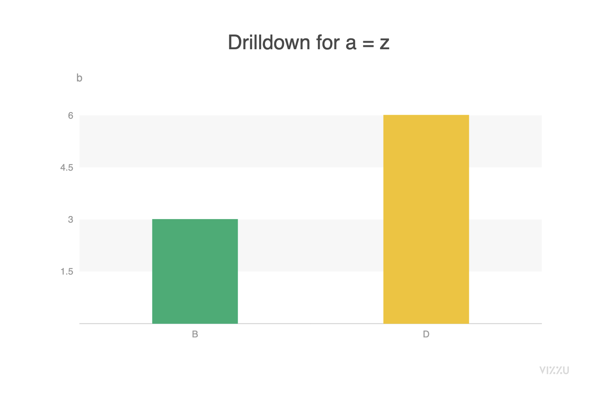

# How-To Guides

## How to Drill into your data with chart interactions

With the streamlit model of always running the script from the top to bottom, it takes
a little bit of extra work to allow clicking on a chart to update the chart itself, but
this can be accomplished by:

1. Accessing the value of the latest click from the chart object
2. Add filters and configuration to the chart that depend on the latest object clicked

Here is some example data:

```python
df = pd.DataFrame(
    {
        "a": ["x", "y", "z", "x", "y", "z"],
        "b": [1, 2, 3, 4, 5, 6],
        "c": ["A", "A", "B", "B", "C", "D"],
    }
)
```

You will start comparing the values of "a" and "b", but when you click on
a bar for a value of "a", the chart will change to show the different values of
"c" associated with that value of "a".

You should pass `rerun_on_click=True` to VizzuChart to
force the streamlit app to rerun every time the chart is clicked.

You can also get the "a" value of the last chart click using the `get` method of the chart, using `.` to access nested values.
If you haven't yet clicked on the chart, or have clicked on something other
than a bar representing an "a" value, this will return None

```python
# This is equivalent to chart["marker"]["categories"]["a"], but won't raise an exception if the nested value isn't found.
bar_clicked = chart.get("marker.categories.a")
```

Finally, you can use the value of the last bar clicked to filter your chart
to show the different "b" and "c" values associated with that value of "a".

```python
if bar_clicked is None:
    chart.animate(Data.filter())
    chart.animate(
        Config({"x": "a", "y": "b", "title": "Look at my plot! Click!", "color": None}),
    )
else:
    chart.animate(Data.filter(f"record['a'] == '{bar_clicked}'"))
    chart.animate(
        Config(
            {
                "x": "c",
                "y": "b",
                "title": f"Drilldown for a = {bar_clicked}",
                "color": "c",
            }
        )
    )
```

Here is the complete script:

```python
import pandas as pd
from ipyvizzu.animation import Config, Data

from streamlit_vizzu import VizzuChart

chart = VizzuChart(rerun_on_click=True)

df = pd.DataFrame(
    {
        "a": ["x", "y", "z", "x", "y", "z"],
        "b": [1, 2, 3, 4, 5, 6],
        "c": ["A", "A", "B", "B", "C", "D"],
    }
)

data = Data()
data.add_data_frame(df)
chart.animate(data)

bar_clicked = chart.get("marker.categories.a")

if bar_clicked is None:
    chart.animate(Data.filter())
    chart.animate(
        Config({"x": "a", "y": "b", "title": "Look at my plot! Click!", "color": None}),
    )
else:
    chart.animate(Data.filter(f"record['a'] == '{bar_clicked}'"))
    chart.animate(
        Config(
            {
                "x": "c",
                "y": "b",
                "title": f"Drilldown for a = {bar_clicked}",
                "color": "c",
            }
        )
    )

chart.show()
```

If you then click on the `z` bar, you will see the chart transition to show
the breakdown of values of `c` that are associated with rows where `a` == `z`



If you click anywhere else on the chart, it will go back to the previous chart

## How to combine and speed up animations

You can pass multiple animations to `chart.animate` at once, rather than
calling `animate` over and over again, like this

```python
chart.animate(
    Data.filter(),
    Config({"x": "a", "y": "b", "title": "Look at my plot! Click!", "color": None}),
)
```

With each series of animations, you can pass `duration` and `delay` values.

You can also pass `default_duration` to specify a default duration (in seconds) that
should be used for all animations that occur in a chart.

For more details about animations, see https://ipyvizzu.vizzuhq.com/tutorial/01_15_animation_options.html
