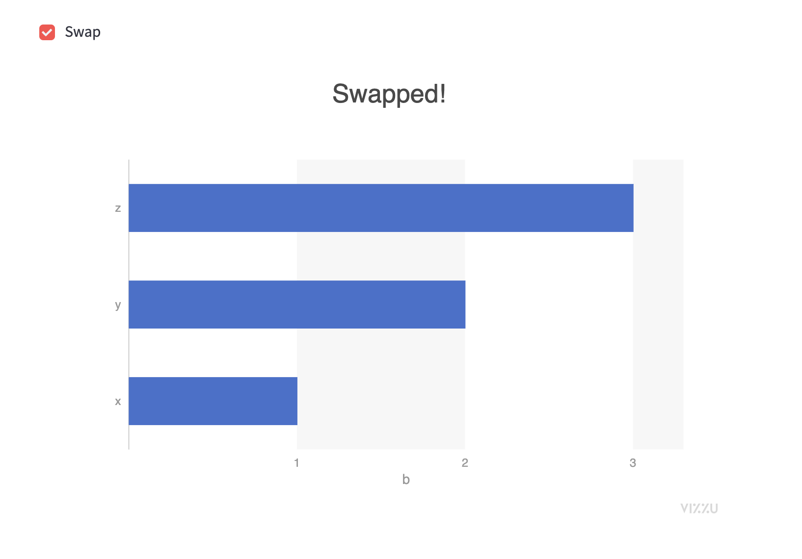

# Getting Started with Streamlit-Vizzu

## Create your first chart

To create a streamlit-vizzu chart, you will need, at minimum, some data to
display, and some configuration to tell Vizzu how to display it.

Create a file called `streamlit_app.py` with the following content

```python
import pandas as pd
import streamlit as st
from ipyvizzu.animation import Config, Data

from streamlit_vizzu import VizzuChart

# Create a VizzuChart object with the default height and width
chart = VizzuChart()

# Generate some data and add it to the chart
df = pd.DataFrame({"a": ["x", "y", "z"], "b": [1, 2, 3]})
data = Data()
data.add_data_frame(df)
chart.animate(data)

# Add some configuration to tell Vizzu how to display the data
chart.animate(Config({"x": "a", "y": "b", "title": "Look at my plot!"}))

# Show the chart in the app!
chart.show()
```

Then do `streamlit run streamlit_app.py` and you should see a plot appear like this:


## Make the chart animated!

There a lots of ways to make static charts in Streamlit apps, but Vizzu Charts aren't
just static, it's easy to animate them to explore the data and display it in different
ways. You can add some code to make this into an interactive app by adding a streamlit
widget and another `chart.animate` call.

Here is a simple example which can be added to the script before `chart.show()`

```python
if st.checkbox("Swap"):
    chart.animate(Config({"y": "a", "x": "b", "title": "Swapped!"}))
```

You should now see a checkbox added to your app, and when you check the box the chart
will transition between the previous version and this new one



## Interact with the chart

One great feature of the VizzuChart component is that you can interact with elements
on the chart and use that data elsewhere in your streamlit app!

If you change the end of your streamlit app to get the return value from `chart.show()`,
you can write that data in your app.

A simple version of this is simply to write out all the data that is returned from
the latest click:

```python
data = chart.show()

st.write(data)
```

Now if you click on one of the bars of your chart, you should see something like
the following below the chart:

```json
{
  "position": {
    "x": 373,
    "y": 335
  },
  "coords": {
    "x": 0.534454,
    "y": 0.186174
  },
  "marker": {
    "categories": {
      "a": "y"
    },
    "values": {
      "b": 2
    },
    "id": 1
  }
}
```

If you want to just present information about the bar which was clicked, you can
do something like this:

```python
data = chart.show()

if data is not none and "marker" in data:
    st.write("value of clicked bar:", data["marker"]["values"]["b"])
```

You should then see something like the following after you click on a bar:

    Value of clicked bar: 2

You can see the result of this tutorial by visiting https://blackary-streamlit-vizzu-official-filters-add-component-djfzc5.streamlit.app/

## Next steps

For more inspiration for what streamlit apps you can build around your Vizzu charts,
you can look in the `example_apps/` folder, and also can see the
[ipyvizzu docs](https://ipyvizzu.vizzuhq.com/) (since this streamlit component behaves
similarly to )
